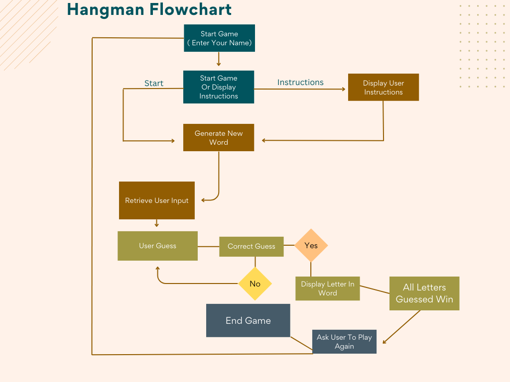

# Phils Hangman

## **Overview**
Hangman is a Python terminal game which runs in the Code Institute terminal on Heroku. 
It was a well played game in my school days with my friends so it was great to create a computerized version.
More information about the rules and history of the game can be found here [Wikipedia](https://en.wikipedia.org/wiki/Hangman_(game))

e [Click here for the final deployed project](https://phils-hangman.herokuapp.com/).

## **Table of Contents**
* [**Phils Hangman**](#Phils Hangman)
  * [**Overview**](#overview)
  * [**Table of Contents**](#table-of-contents)    
* [**Planning Phase:**](#planning-phase)
  * [***User Stories:***](#user-stories)

# **Planning Phase:**
## ***User Stories:***
As a user, I want to be able to:
* From the offset see clearly what the game is.
* Bring back memeories of playing this game in the school days
* Play an computirized version of hangman by myself.

## ***Site Aims:***
The site aims to:
1. Make it clear what the game is without the need for further explanation from external sources.
1. Communicate a clear and appropriate response to all user inputs.
1. Continue in a loop without ever crashing due to an error caused by the user's input.
1. Allow the user to have an enjoyable experience playing hangman by themselves.
  
## ***How Will This Be Achieved:***
To achieve the above, the site will:
1. Provide a welcome screen with the game name in ascii art.
1. Ensure that all user input provides an appropriate response.
1. Any time the user input is not as expected by the game, the app will show a message to inform the user that their entry was invalid and guide them on how to input as expected.
1. Executing all of the above in a way that successfully replicates the original game of hangman.

## Features

### Welcome Screen
The welcome section is the screen the end user is presented with on page load. It provides the user with an introduction, along with an input to enter the users name. This is validated before continuing.

### Instructions

If the user enters 'i' the game instructions will be showed to the user.

### Play

If the user enters 'p' the game will print a message "Starting the battle..." the user will then have to input their "username"

### Enter Username

Once the user enters their username, they will recieve a welcome message to the game and their username will be now shown.

### Random Board Generator

### Player Feedback

Entering co-ordinate

Entering 2nd co-ordinate

If player enters the same co-ordinates already guessed before

### Score Count

Score count will keep track and displays the scores

### Number of Turns

Number of turns keep track of the current amount of turns

### Play Again

-   When the player or the computer has destroyed all the opponents ship the game will finish.

### Goodbye

-   If the player decides against playing again, they will get a goodbye message.

[Back to top](#table-of-contents)

---

## Future Features

-   In the future, I would like to add more features such as;

---

## Design

---

## Data Model

Canva was used in the development stages of this project. I used a simple flow chart to help me structure what functions I would be using and the main layout

[Back to top](#table-of-contents)

---

## Testing

## Validation

-   Pass Python script through ()
-   No errors found on run script file

## General Testing

-   All errors fixed during testing

[Back to top](#table-of-contents)

---

## Bugs

 Bug Explanation:
 Previously, there was a bug in the code where it only accepted capital letters for the restart input.
 This meant that lowercase "y" and "n" would not trigger the desired behavior.

 Fix Explanation:
 To fix this bug, I modified the code to convert the restart input to uppercase using the `.upper()` method.
 This change allows for case-insensitive comparisons against "Y" and "N".
 Now, regardless of whether the user enters lowercase or uppercase "Y" or "N", the code will function correctly.

## Deployment

### Heroku

The app was deployed via Heroku and the live link can be found here [Battleships Game](https:/)

-   To deploy the project through Heroku, the following steps were taken:
-   Sign up / Log in to [Heroku](https://www.heroku.com/)
-   From the main Heroku Dashboard, press the 'New' button and then press on the 'Create New App' button.
-   Give the project a name (Needs to be a unique name) and then select the region that is suitable to you. After this is done, press on the 'Create App' button.
-   Once the app has been created, you will be redirected to the deploy section. Using the submenu at the top, press on the settings button.
-   Once on the settings page, scroll down a to the 'Config vars' section. Once located, press on the 'Reveal congfig vars' button. This will reveal the current config vars for the app. There should not be any vars configured beforehand.
-   In the KEY input field, input PORT in capital letters and in the VALUE field, input 8000. Then click on the 'Add' button. This needs to be done for the Code Institute template. If you are not using the CI template, you may not need to do this.
-   Next, you need to click on the 'Add buildpack' button below. This should trigger a popup. Select Python as your first buildpack and press on the 'save changes' button.
-   Repeat the above step but this time select Node.js as the buildpack. The order of the buildpacks is important. Python should be first and Node.js second. If you accidently do them in the wrong order, you can click on either buildpacks and drag them to put them in the correct order.
-   Next, you need to navigate to the deploy page which you can do from the submenu at the top of the page.
-   Once on the deploy page, look for the deployment method section and press on the Github logo. Once done, a small section should appear underneath. Click on the 'Connect to GitHub' button. On your first time doing this, you may be promted to follow some steps which you should do.
-   Once done, a 'Connect to GitHub section should appear. Here you will need to search for the repository you want to connect to. You can either type in the repository name in the input field and press search or you can just press search right away and a list of all your repositories should appear and you can press on the one you would like to connect to. Once you have have found the repository you would like to connect to, press on the 'Connect' button on the right hand side.
-   Now that your app has been connected to GitHub, double check the 'Choose a branch deploy' drop down menu is deploying the correct branch from your GitHub Repository. Once you are sure, you need to decide if you would like to enable automatic deploys via the 'Enable Automatic Deploys' button below or if you would like to deploy it manually everytime. The difference is, with automatic deploy, your app will be updated automatically everytime you push the changes in GitHub where as with manual deploy, you will need to go back to the deploy page everytime you want to update the app with the changes. I prefer for it to be automatically done but it is entirely upto you.
-   Once you have decided how you want the deploys to be, press on the deploy branch below. Heroku will now build the app for you. Once it has been completed, a 'Your App Was Successfully Deployed' message will appear with a link the live site.

[Back to top](#table-of-contents)

---

# Credits

-   Code Institute - [Code Institute](https://github.com/Code-Institute-Org/python-essentials-template)
-   I used Code Institute gitpod full template and Python Essentials in the Full Stack Development course.
-   W3 Schools - [W3 Schools](https://www.w3schools.com/)
-   README.md for the template - https://github.com/Code-Institute-Solutions/readme-template
-   Rory Patrick Sheridan README.md to help with structure content in my README.md - https://github.com/Ri-Dearg/horizon-photo/blob/master/README.md#page-elements
-   Rory Patrick Sheridan for his support throughout my mentor sessions.
-   Slack community
-   Code Institute Tutors.

[Back to top](#table-of-contents)

---

# Other Comments
